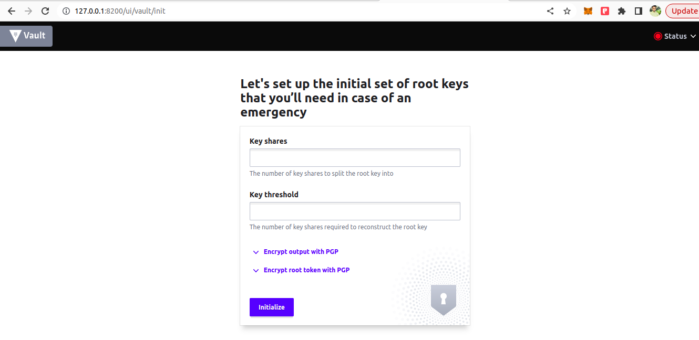
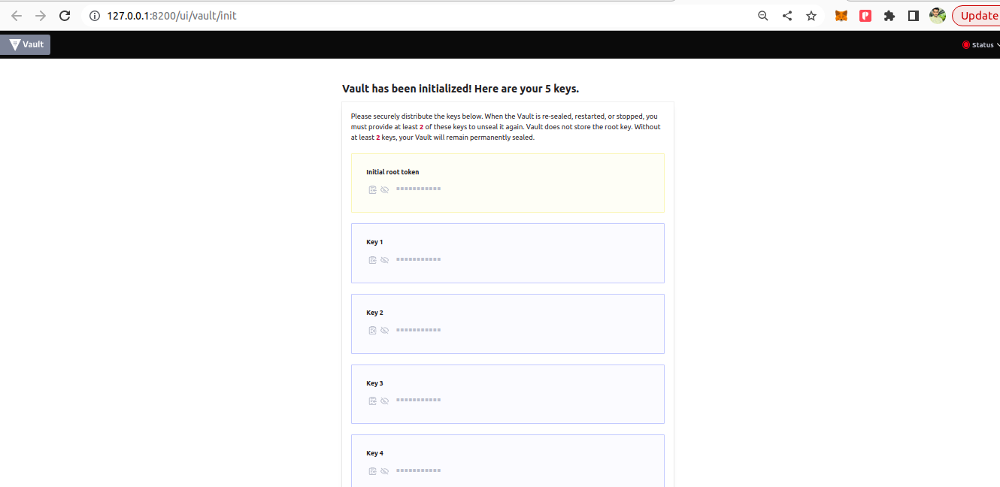
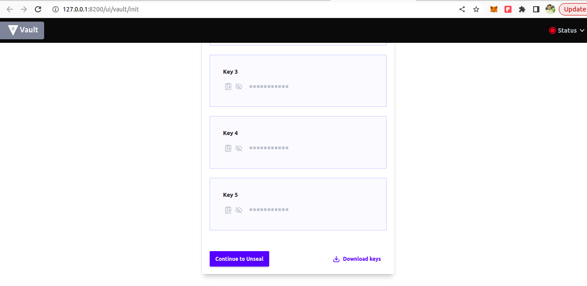
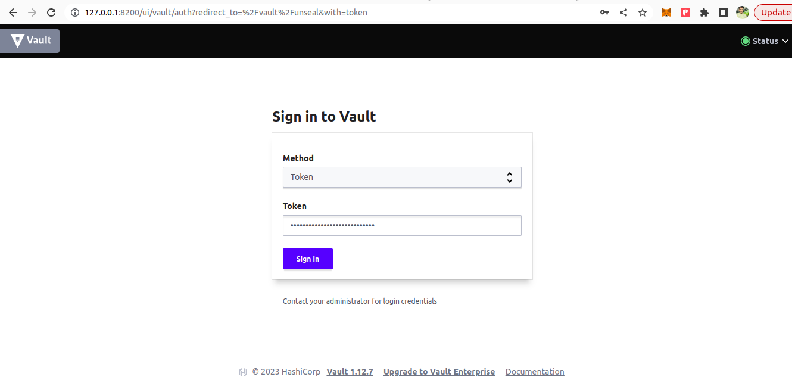
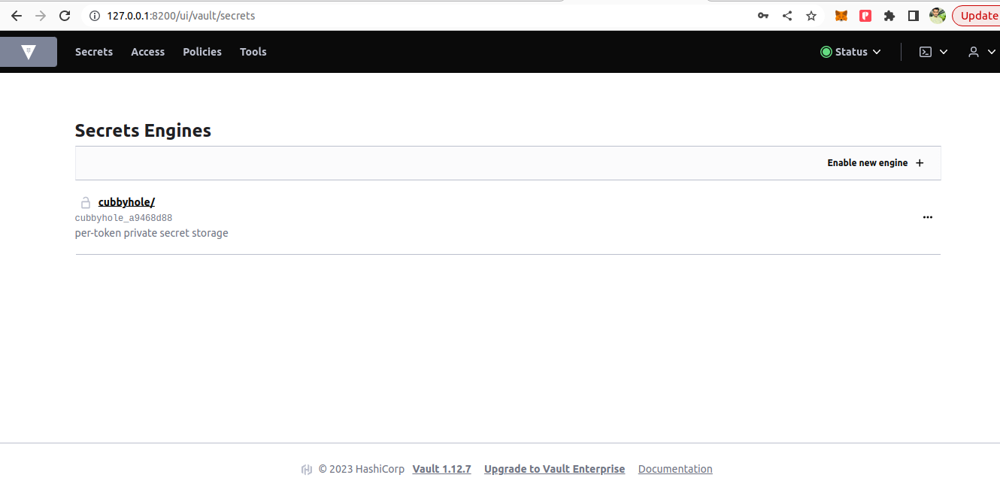
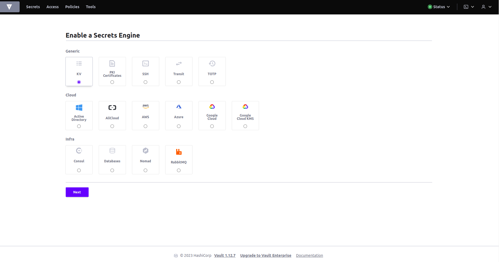
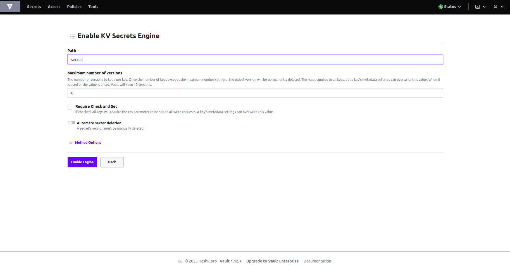

# Self Managed Wallets

The Self-Managed Wallet (SMW) system is designed as a custodial wallet solution that operates within the client's environment. It empowers users to generate and retain cryptographic keys within their infrastructure, ensuring a higher level of control and security. The architecture incorporates a robust key storage mechanism to safeguard keys, with the added convenience of integrating with KrypCore Web3 services, enabling seamless utilization of KrypCore functionalities using self-generated keys. 


## Prerequisite

Docker
Docker Compose

## Running Self Managed Wallets

Follow these steps to set up and run a self-managed wallet using the provided repository.

### Cloning the Repository

Start by cloning the repository to your local system using the following command:

```bash
git clone git@github.com:krypc-code/wallet-kms.git
```

### Setting Up the Environment

After cloning the repository, navigate to the `test` folder:

```bash
cd test
```

Launch the HashiCorp Vault service using Docker Compose:

```bash
sudo docker-compose -f docker-compose-vault.yaml up -d
```

**Vault Initialization Steps:**

1. **Access the Vault UI:**
    - Start the Vault server.
    - Open a web browser and navigate to http://127.0.0.1:8200.
   
      

2. **Set Keyshare and Key Threshold:**
    - In the Vault UI, locate the settings for key sharing.
    - Set the number of keyshares (e.g., 5) and the key threshold (e.g., 3).
    - These values determine the number of key parts required to unseal the vault.
   

3. **Generate Key Pairs:**
    - Click on the "Initialize" button in the Vault UI.
    - This action triggers the generation of a set of key and root token pairs.
      

4. **Download and Save Keys:**
    - After initialization, download the generated keys.
    - Save the downloaded keys securely on your local machine.
      

5. **Provide Unseal Keys:**
    - Open the downloaded key file and find the keys_base64 values.
    - Depending on the threshold set earlier, gather the required number of keys_base64 values.
    - These keys will be used to unseal the vault.

6. **Unseal the Vault:**
    - In the Vault UI, locate the "Unseal" section.
    - Paste the collected keys_base64 values into the designated fields, based on the threshold.
    - Click "Continue" to unseal the vault.
      

7. **Provide Root Token:**
    - In the Vault UI, find the field to input the root token.
    - Enter the root token obtained during the initialization process.
      

8. **Sign In to Vault:**
    - Click on the "Sign In" or "Log In" button in the Vault UI.
    - If the root token is valid, you will gain access to the Vault.
     

9. **Create New Engine:**
    - Create new secret engine by selecting KV on the options screen.
      

10. **Secret As Path:**
   - Create new path with value "secret" in path param.
      

11. **Vault Initialization Complete:**
    - At this point, your Vault is initialized and accessible.


Ensure that you keep the downloaded keys and root token secure.


Once the Vault service is running and initialized successfully,update the environment variables in the `docker-compose-kms.yaml` file as follows:

```yaml
"VAULT_URL": "http://127.0.0.1:8200",
"VAULT_TOKEN": "hvs.6xYh1CwO2ekf1ZpjryumvqmQ",
"AUTH_TOKEN": "abd3789a-8a15-4e5a-8644-ed65a2c2e7f6",
"PROXY_URL": "http://localhost:8888",
"ENDPOINT": "https://polygon-mumbai-dev-node.krypcore.com/api/v0/rpc?apiKey=1ddc4575-fe65-4f00-a420-9d8a7a4086aa&token=abd3789a-8a15-4e5a-8644-ed65a2c2e7f6",
"WALLET_INSTANCE_ID": "INS_NC_17_2023721",
"SUBSCRIPTION_ID": "6186952413",
"SCHEDULER_DURATION": "10"
```

### Running the Service

Once you've configured the environment variables, run the self-managed wallet service using the following command:

```bash
sudo docker-compose -f docker-compose-kms.yaml up -d
```

### Creating a Wallet

After the self-managed wallet service is up and running, use the following curl command to create a wallet:

```bash
curl -d '{"name":"wallet2", "algorithm": "secp256k1"}' -H "Content-Type: application/json" -X POST http://localhost:8889/wallet/createWallet
```

You will receive a response with a unique wallet ID, which you can use for further operations.

### Submitting a Transaction

To submit a transaction, use the following curl command:

```bash
curl -d '{
  "walletId": "effae2b6-3ee3-48cb-9528-87c29152c89e",
  "to": "0xc2de797fab7d2d2b26246e93fcf2cd5873a90b10",
  "chainId": 80001,
  "method": "store",
  "params": [{"type": "uint256", "value": "35"}],
  "isContractTxn": true,
  "contractABI": "[{\"inputs\":[{\"internalType\":\"uint256\",\"name\":\"num\",\"type\":\"uint256\"}],\"name\":\"store\",\"outputs\":[],\"stateMutability\":\"nonpayable\",\"type\":\"function\"},{\"inputs\":[],\"name\":\"retrieve\",\"outputs\":[{\"internalType\":\"uint256\",\"name\":\"\",\"type\":\"uint256\"}],\"stateMutability\":\"view\",\"type\":\"function\"}]"
}' -H "Content-Type: application/json" -X POST http://localhost:8889/wallet/submitTransaction
```

### Deploying a Smart Contract

To deploy a smart contract, use the following curl command:

```bash
curl -d '{
  "walletId": "effae2b6-3ee3-48cb-9528-87c29152c89e",
  "byteCode": "",
  "abi": "",
  "params": []
}' -H "Content-Type: application/json" -X POST http://localhost:8889/wallet/deployContract
```

This will allow you to deploy a smart contract and receive a transaction hash and contract address in response.


### Estimating Gas Price

To estimate gas for a transaction, use the following curl command:

```bash
curl -d '{
  "walletId": "effae2b6-3ee3-48cb-9528-87c29152c89e",
  "to": "0xc2de797fab7d2d2b26246e93fcf2cd5873a90b10",
  "method": "store",
  "params": [{"type": "uint256", "value": "35"}],
  "isContractTxn": true,
  "contractABI": "[{\"inputs\":[{\"internalType\":\"uint256\",\"name\":\"num\",\"type\":\"uint256\"}],\"name\":\"store\",\"outputs\":[],\"stateMutability\":\"nonpayable\",\"type\":\"function\"},{\"inputs\":[],\"name\":\"retrieve\",\"outputs\":[{\"internalType\":\"uint256\",\"name\":\"\",\"type\":\"uint256\"}],\"stateMutability\":\"view\",\"type\":\"function\"}]"
}' -H "Content-Type: application/json" -X POST http://localhost:8889/wallet/estimateGas
```

### Get Wallet Balance

To get balance of a wallet, use the following curl command:

```bash
curl -d '{
  "walletId": "effae2b6-3ee3-48cb-9528-87c29152c89e","chainId": "80001"
}' -H "Content-Type: application/json" -X POST http://localhost:8889/wallet/getBalance
```

### Call Contract Method

To call contract method, use the following curl command:

```bash
curl -d '{
  "walletId": "effae2b6-3ee3-48cb-9528-87c29152c89e",
  "to": "0xc2de797fab7d2d2b26246e93fcf2cd5873a90b10",
  "method": "store",
  "params": [{"type": "uint256", "value": "35"}],
  "contractABI": "[{\"inputs\":[{\"internalType\":\"uint256\",\"name\":\"num\",\"type\":\"uint256\"}],\"name\":\"store\",\"outputs\":[],\"stateMutability\":\"nonpayable\",\"type\":\"function\"},{\"inputs\":[],\"name\":\"retrieve\",\"outputs\":[{\"internalType\":\"uint256\",\"name\":\"\",\"type\":\"uint256\"}],\"stateMutability\":\"view\",\"type\":\"function\"}]"
}' -H "Content-Type: application/json" -X POST http://localhost:8889/wallet/callContract
```

### Sign Message

To sign a message, use the following curl command:

```bash
curl -d '{"walletId": "effae2b6-3ee3-48cb-9528-87c29152c89e","message":"Hello"}' -H "Content-Type: application/json" -X POST http://localhost:8889/wallet/signMessage
```

### Verify Signature Offchain

To verify signature offchain, use the following curl command:

```bash
curl -d '{"walletId": "effae2b6-3ee3-48cb-9528-87c29152c89e","message":"Hello","signature":"0x0274ba1a35dd8dfcf279a660f970985036c1432ceead1e05b81443b9d94bac403e4e2e8dbab494fe428e212ed0e9b2f8ebac327c5971dc461c9b147bc33fbc5301"}' -H "Content-Type: application/json" -X POST http://localhost:8889/wallet/verifySignatureOffChain
```

Remember to replace the placeholders with actual values as needed.